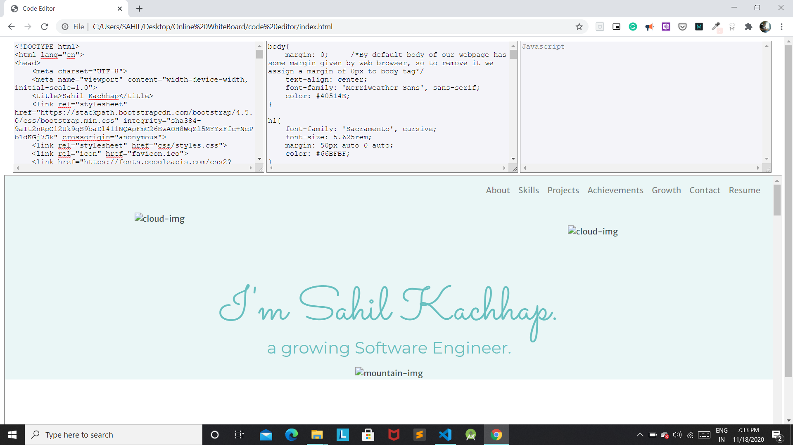

# Web Dev Code Editor

 

### Show some :heart: and star the repo to support the project

## Overview
This is a Basic Code Editor and currently supports HTML,CSS and JavaScript Compilation (Basic Version).

## Technology Stack
- HTML
- CSS 
- Javascript

## Future Enhancements
- Improving the overall CSS Styling.

## Getting Started 🚀
- Fork The Repo
- Clone the repo `git clone https://github.com/Sahil-kachhap/GDG-Devfest-India`

